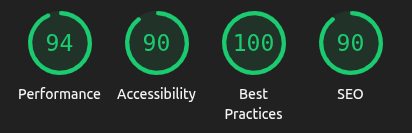
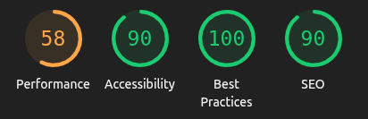

# Muralis FinLog

### Sumário

1. [Pré requisitos](#pré-requisitos)
2. [Introdução](#introdução)
3. [Tecnologias utilizadas](#tecnologias-utilizadas)
4. [Resultados do Lighthouse](#resultados-do-lighthouse)
5. [Pontos passíveis de melhorias](#pontos-passíveis-de-melhorias)
6. [Executando o projeto](#executando-o-projeto)

---

### Pré-requisitos

Para executar este projeto localmente, é necessário ter instalado:

- [Git](https://git-scm.com/)
- [Docker](https://www.docker.com/)
- [Java (v17+)](https://www.oracle.com/java/technologies/downloads/)
- [Maven](https://maven.apache.org/) (caso não utilize uma IDE como IntelliJ)
- [Node.js (v18+)](https://nodejs.org/) e [NPM](https://www.npmjs.com/)

Recomenda-se o uso do [IntelliJ IDEA](https://www.jetbrains.com/idea/) para rodar o backend e de um terminal com suporte a Docker.

---

### Introdução

- Projeto desenvolvido para aplicação de vaga na [Muralis](https://www.muralis.com.br/) onde o desafio técnico era realizar um CRUD completo de despesas financeiras.

* As tarefas foram organizadas e acompanhadas por meio de um quadro no [Trello](https://trello.com/b/DRf6fndt/muralis-finlog) podendo ser acessado em: https://trello.com/b/DRf6fndt/muralis-finlog.
* O versionamento do código seguiu a convenção Conventional Commits, integrando o identificador numérico do cartão do Trello no nome das branches e nas mensagens de commit para facilitar rastreabilidade e organização.

#### Lógica do padrão adotado:

* **Branch:** o formato é `<tipo>/<id-cartao>-<descrição>`, por exemplo:

```bash
feat/4-endpoint
```

onde `feat` indica o tipo de alteração (feature), `4` é o número do cartão no Trello, e `endpoint` é uma breve descrição do que foi implementado.

* **Commit:** segue o padrão Conventional Commits incluindo o número do cartão entre parênteses:

```bash
feat(4): create endpoint
```

O projeto foi desenvolvido majoritariamente em inglês, com exceção elementos visuais exibidos na interface.

---

### Tecnologias utilizadas

#### Frontend

- TypeScript  
- React 19.0.0  
- Next.js 15.3.3  
- Tailwind CSS 4  
- React Hook Form  
- Zod
- Redux Toolkit Query

#### Backend

- Java 17  
- Spring Boot 3.5.0  
- Flyway  
- PostgreSQL  
- JDBC Template
- JUnit e Mockito
- Docker

---

### Resultados do Lighthouse
A aplicação foi avaliada com a ferramenta Lighthouse, que analisa critérios como performance, acessibilidade, boas práticas e SEO. Os resultados a seguir foram obtidos a partir de uma execução local 

#### Desktop



#### Mobile



---

### Pontos passíveis de melhorias

Embora o projeto cumpra os requisitos principais, alguns pontos podem ser aprimorados para aumentar a qualidade e a experiência do usuário:

- Melhorar o fluxo de alguns endpoints, onde faltou aplicar o padrão de arquitetura adotado pelo sistema.

- Componentizar melhor elementos do frontend, como modal e formulário nas telas de cadastro/edição de despesas.

- Adicionar uma interface mais mobile-friendly, utilizando por exemplo cartões ao invés de tabelas na versão mobile da aplicação.

- Implementar testes unitários no frontend para garantir maior qualidade do código.


## Executando o projeto

1. Realize o clone através de SSH ou HTTPS

```bash
> git clone git@github.com:HenriqueLopesDev/muralis-finlog.git
```

2. Na raiz do projeto, adicione um arquivo .env contendo as variáveis para o Docker subir o container do PostgreSQL conforme exemplo abaixo ou o arquivo .env.example:

```bash
POSTGRES_DB=finlog
POSTGRES_USER=finlog
POSTGRES_PASSWORD=abc12345
```

3. Com as variáveis de ambiente do Docker configuradas, execute o comando abaixo:

```bash
> docker compose up --build
```
- O PostgreSQL estará rodando na porta padrão **5432**.

4. Configure o backend. No diretório **finlog-backend-spring**, defina as variáveis de ambiente conforme o *application.properties*:

```bash
spring.application.name=finlog-backend-spring
spring.datasource.url=${DB_URL}
spring.datasource.username=${DB_USER}
spring.datasource.password=${DB_PASSWORD}
viacep.api.url=https://viacep.com.br/ws/

server.servlet.context-path=/api
```
- **DB_URL** é a URL de conexão do PostgreSQL com o valor da variável **POSTGRES_DB**.
- **DB_USER/DB_PASSWORD** devem ter o mesmo valor das variáveis **POSTGRES_USER/POSTGRES_PASSWORD**.
- Os valores podem ser colocados direto no arquivo *application.properties*.

5. Na raiz do projeto backend em **finlog-backend-spring**, inicie a aplicação através do IntelliJ ou do comando abaixo:

```bash
> mvn spring-boot:run
```
- Se o container do PostgreSQL estiver em execução e as variáveis de ambiente configuradas corretamente, a aplicação subirá corretamente. Por padrão o backend estará acessível através da porta **8080**.
- A documentação da API estará disponível em:
http://localhost:8080/api/swagger-ui/index.html ou de acordo com a porta utilizada.

6. Na raiz do projeto frontend, crie um arquivo **.env.local** de acordo com o arquivo **.env.example** ou com o exemplo abaixo:

```bash
NEXT_PUBLIC_API_URL=http://URL/api
```

- **URL** deve ter o endereço da aplicação backend incluindo a porta.

7. Na raiz do projeto frontend em **finlog-frontend-spring**, instale as dependências através do NPM:

```bash
> npm i
```

8. Inicie a aplicação frontend através do comando:

```bash
> npm run dev
```
- Por padrão o frontend estará acessível através da porta **3000**.

9. Acesse **http://localhost:3000**, ou a porta que o Next utilizou, para visualizar a aplicação.


